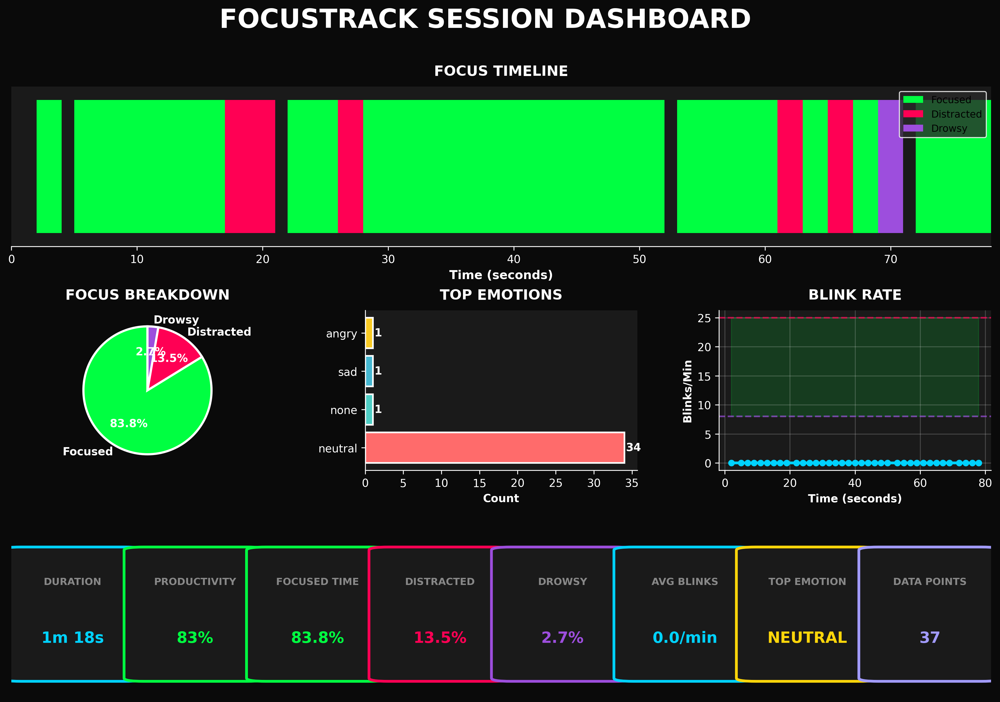

# FocusTrack

Real-time focus and distraction monitoring system using computer vision and deep learning.

## Overview

FocusTrack uses facial emotion recognition and eye tracking to analyze study/work sessions. It detects when you're focused, distracted, drowsy, or looking away from the screen.

## Features

- Real-time emotion detection (7 emotions: angry, disgust, fear, happy, neutral, sad, surprise)
- Eye tracking and blink rate analysis
- Focus state classification (focused, distracted, drowsy)
- Session recording with timestamps
- Automated visualization generation
- Productivity scoring

## Model Performance

- Dataset: FER2013 (28,709 training images)
- Test Accuracy: 59.28%
- Architecture: Custom CNN with batch normalization and dropout
- Input: 48x48 grayscale images

## Installation
```bash
git clone https://github.com/yourusername/FocusTrack.git
cd FocusTrack
python -m venv venv
source venv/bin/activate  # On Windows: venv\Scripts\activate
pip install -r requirements.txt
```

## Usage

### Basic Emotion Detection Test
```bash
python test_model.py
```

### Advanced Focus Tracking Session
```bash
python focus_tracker.py
```

Press 'q' to quit and save session data.

### Generate Visualizations
```bash
python dashboard.py session_advanced_YYYYMMDD_HHMMSS.csv
```

## Project Structure
```
FocusTrack/
├── models/
│   └── emotion_model.keras
├── src/
│   ├── test_model.py
│   ├── focus_tracker_advanced.py
│   └── dashboard.py
├── sample_outputs/
│   ├── session_advanced_XXXXXX_dashboard.png
│   └── session_advanced_XXXXXX.csv
├── notebooks/
│   └── model_training.ipynb (your Colab notebook)
├── README.md
├── requirements.txt
└── .gitignore
```

## How It Works

### 1. Emotion Recognition
- CNN trained on FER2013 dataset
- Detects 7 basic emotions from facial expressions
- Real-time inference on webcam feed

### 2. Eye Tracking
- Detects both eyes using Haar Cascade classifiers
- Tracks eye position and aspect ratio
- Monitors blink rate for drowsiness detection

### 3. Focus Classification

**Focused**: Neutral emotion + both eyes visible + centered gaze
**Distracted**: Happy emotion OR only one eye visible OR eyes off-center
**Drowsy**: Low blink rate (<8/min) OR sad emotion OR eyes closing

### 4. Visualization
- Focus timeline with color coding
- Emotion distribution pie chart
- Focus state breakdown
- Blink rate analysis
- Session summary card

## Sample Output

Session data logged every 2 seconds with:
- Timestamp
- Emotion detected
- Number of eyes visible
- Blink rate
- Focus state classification

## Technical Details

### Model Architecture
- Input: 48x48 grayscale images
- 3 Convolutional blocks with batch normalization
- MaxPooling and dropout for regularization
- 2 Dense layers with 512 and 256 units
- Softmax output for 7 emotion classes

### Dependencies
- TensorFlow 2.x
- OpenCV
- Pandas
- Matplotlib
- Seaborn
- NumPy

## Results

Example session metrics:
- Duration: 2 hours
- Focus rate: 45-65%
- Distraction rate: 25-40%
- Drowsiness rate: 5-15%

## Future Improvements

- Integration with Pomodoro timer
- Head pose estimation for 3D gaze tracking
- Multi-face tracking for group study sessions
- Mobile app deployment
- Cloud-based analytics dashboard

## License

MIT License

## Author

Anshu Aditya

## Acknowledgments

- FER2013 dataset for emotion recognition training
- OpenCV for computer vision tools
- TensorFlow/Keras for deep learning framework
```

Now create `requirements.txt`:
```
tensorflow==2.20.0
opencv-python==4.10.0.84
numpy<2
pandas==2.2.3
matplotlib==3.9.3
seaborn==0.13.2
pillow==11.0.0