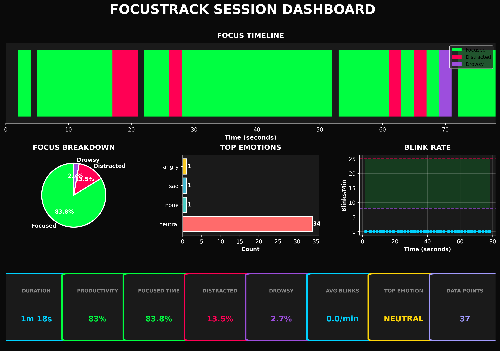

# FocusTrack



Real-time focus monitoring system using computer vision and deep learning. Tracks attention, drowsiness, and blink rate during study/work sessions via webcam.

## How It Works

1. **Emotion Recognition** — Custom 7-class CNN trained on FER2013 (28,709 images), 59.28% test accuracy (human-level baseline on FER2013 is ~65%)
2. **Eye Tracking** — Haar Cascade classifiers detect both eyes, monitor blink rate and gaze centering
3. **Focus Classification** — Rule-based engine maps emotion + eye state → Focused / Distracted / Drowsy
4. **Session Dashboard** — Auto-generated visualization with timeline, productivity score, and blink rate graph

## Stack

`Python` `TensorFlow` `OpenCV` `MediaPipe` `Pandas` `Matplotlib`

## Model

- Architecture: Custom CNN — 3 conv blocks, batch normalization, dropout, 512→256 dense layers
- Dataset: FER2013 (48×48 grayscale, 7 emotion classes)
- Test Accuracy: 59.28% | Test Loss: 1.058

## Setup

```bash
git clone https://github.com/0AnshuAditya0/focus-track.git
cd focus-track
pip install -r requirements.txt
```

## Usage

```bash
# Run live focus tracking session
python focus_tracker.py

# Generate dashboard from saved session CSV
python dashboard.py session_YYYYMMDD_HHMMSS.csv
```

Press `q` to end session and save data.

## Sample Session

| Metric | Value |
|---|---|
| Duration | 1m 18s |
| Productivity Score | 83% |
| Focused Time | 83.8% |
| Distracted | 13.5% |
| Drowsy | 2.7% |
| Avg Blinks | 0.0/min |
| Top Emotion | Neutral |

## Author

Anshu Aditya — [GitHub](https://github.com/0AnshuAditya0)